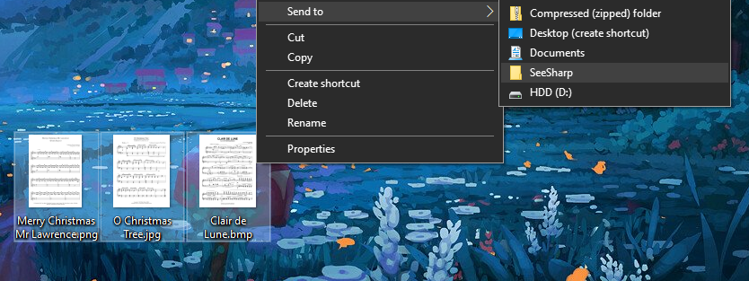
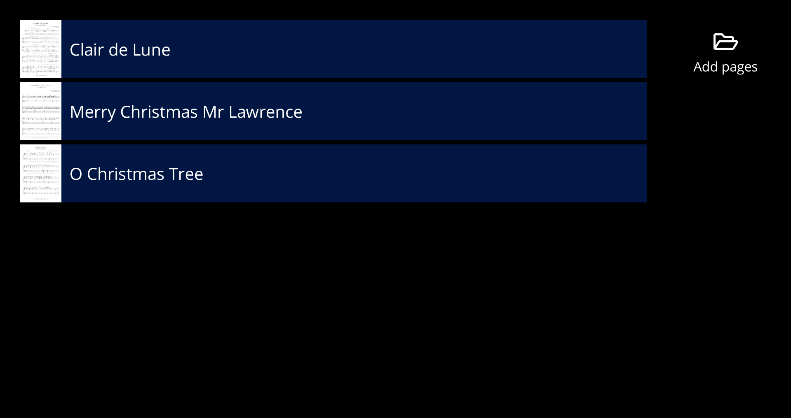
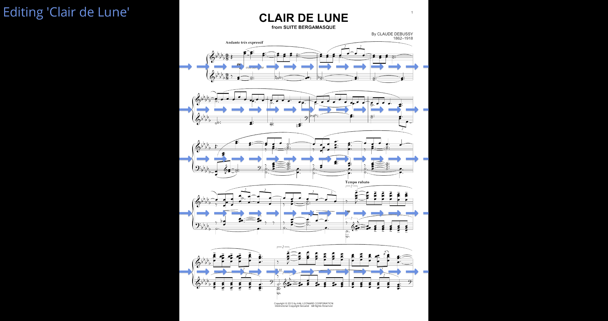
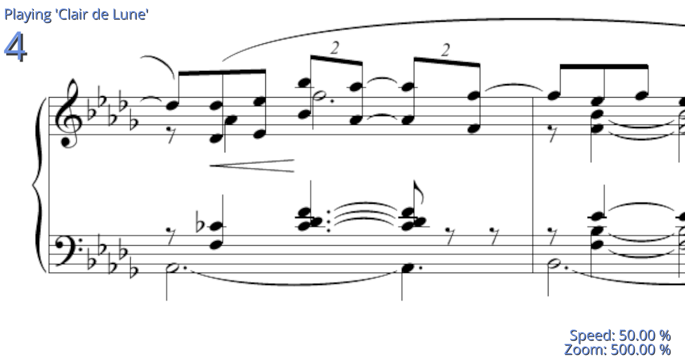

  

# SeeSharp

## impaired vision sheet music reader

inspired by [MagniPy](http://www.makersbox.us/2013/10/magnipy-low-vision-music-reader.html),

built with [osu-framework](https://github.com/ppy/osu-framework)

## Download
download the [latest version](https://github.com/hbnrmx/SeeSharp/releases/latest) for Windows 10

## Help
Hold down `F1` on any screen to get help

## Screenshots

