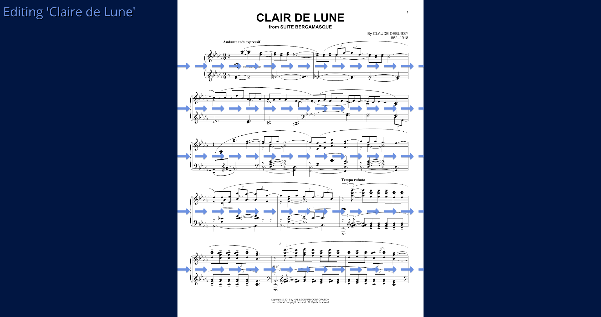

# 🔎 SeeSharp

## impaired vision sheet music reader

inspired by [MagniPy](http://www.makersbox.us/2013/10/magnipy-low-vision-music-reader.html),

built with [osu-framework](https://github.com/ppy/osu-framework)

Feel free to try out and give some early feedback if you like!

## 📥 Download

download the [latest version](https://github.com/hbnrmx/SeeSharp/releases/latest) for Windows 10

## 🧰 Installation

Just double-click the `exe`!

If you would like to use the `Send to` shortcut as shown in the screenshot below, please run this [powershell script](https://github.com/hbnrmx/SeeSharp/blob/master/scripts/createSendToShortcut.ps1)

## 😕 Help

If you have any questions feel free to [open an issue](https://github.com/hbnrmx/SeeSharp/issues/new)

Hold down `F1` on any screen to get help

## 📷 Screenshots

